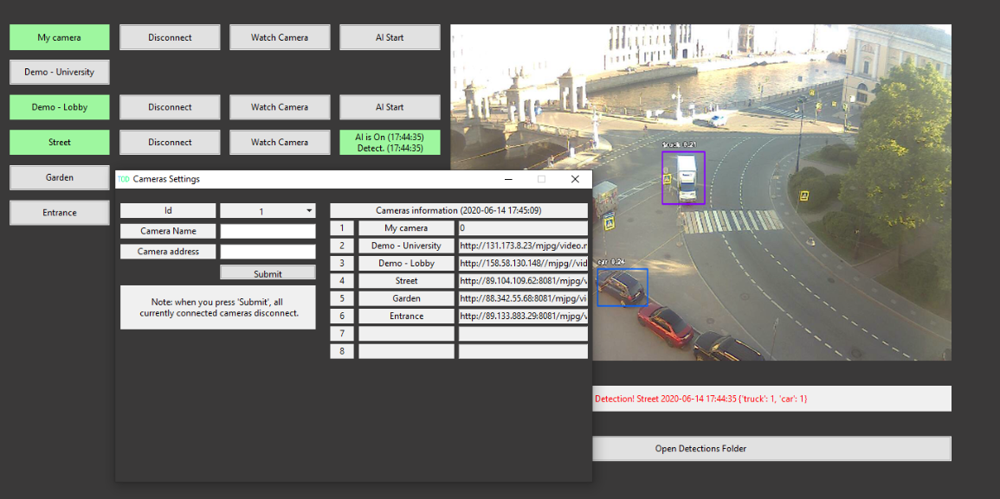

# Terra Object Detection (v. 0.9.0 Beta)

An application based on ImageAI library which can run object detection tasks from device cameras and IP cameras in real time.

- Detects and saves detections as separate images as well as immediately notifies user about detection
- Availability to choose detection speed and accuracy
- Up to 8 cameras can be saved and work simultaneously in the current version



## Object Detection

An application uses YOLOv3 and TinyYOLOv3 models for object detection.

### Requirements for Developers

- Python 3.7.4
- ImageAI 2.1.5
- Tensorflow 1.11
- OpenCV 4.1.0.25
- Keras 2.2.4
- yolo.h5 and yolo-tiny.h5 models

### Installation

1. Install ImageAI 2.1.5 and all necessary dependencies
- ImageAI:
```
pip3 install imageai --upgrade
```
- Tensorflow:
```
pip3 install tensorflow==1.11.0
```
- OpenCV:
```
pip3 install opencv-python
```
- Keras:
```
pip3 install keras
```
2. Download yolo.h5 and yolo-tiny.h5 and locate them together with other files in venv\ directory
- [Yolo.h5](https://github.com/OlafenwaMoses/ImageAI/releases/download/1.0/yolo.h5)
- [Yolo-tiny.h5](https://github.com/OlafenwaMoses/ImageAI/releases/download/1.0/yolo-tiny.h5)

3. Locate [__ init __.py](https://github.com/Avrilo/TerraObjectDetection/blob/master/__init__.py) in venv\Lib\site-packages\imageai\Detection (change the existing file)

Run [_appearance.py](https://github.com/Avrilo/TerraObjectDetection/blob/master/_appearance.py) to launch the application.

## License

This project is licensed under the MIT License.

## Contacts

* avrilo@tutanota.com
